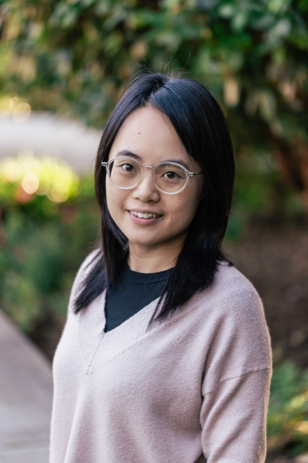

---

---

Since 2024, I have been a postdoctoral scholar at [Scripps Institution of Oceanography](https://scripps.ucsd.edu/), working with [Dr. Amato Evan](https://scripps.ucsd.edu/profiles/aevan), [Dr. William Porter](https://profiles.ucr.edu/william.porter), and the [UC Dust team](https://ucdust.ucsd.edu/team-2/). My current research focuses on improving the representation of dust in a regional atmospheric model and investigating how environmental change affects dust emissions and their impacts on communities and climate.

Before that, I earned my Ph.D. in Energy, Environmental & Chemical Engineering from [Washington University in St. Louis](https://wustl.edu/) (2019–2024), advised by [Dr. Randall Martin](https://engineering.washu.edu/faculty/Randall-Martin.html) and [Dr. Jay Turner](https://engineering.washu.edu/faculty/Jay-Turner.html). My doctoral research focused on improving ground-based measurements of mineral dust and trace elements in ambient particulate matter and understanding their contributions to air pollution. I received my B.S. in Chemical Engineering and Technology from [Xiamen University](https://en.xmu.edu.cn/) (2015–2019).

Outside of work, I enjoy kayaking, hiking, and reading.

---
